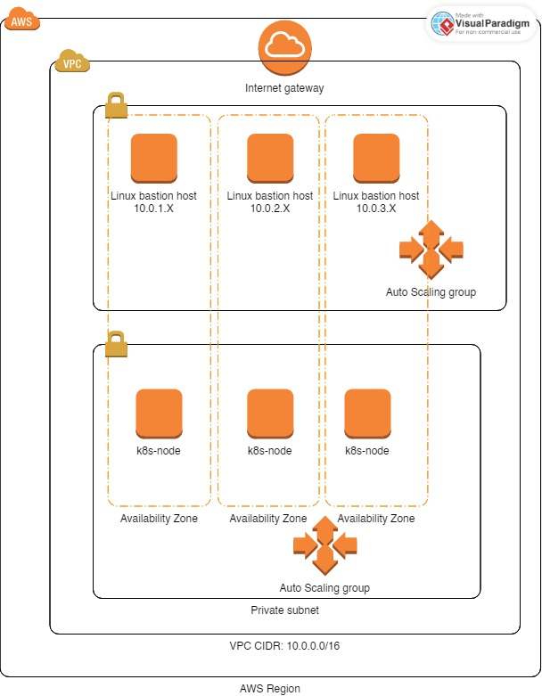

# EKS Infrastructure Deployment with Terraform Cloud and CircleCI

This project demonstrates a production-ready Infrastructure as Code (IaC) deployment pipeline for Amazon Elastic Kubernetes Service (EKS) using Terraform, managed through Terraform Cloud for state storage and CircleCI for continuous integration and deployment.

## Architecture Overview

The infrastructure deploys a fully managed Kubernetes cluster on AWS with the following components:

- **Amazon EKS Cluster** (Kubernetes 1.29) with managed control plane
- **VPC with Multi-AZ Setup** across 3 availability zones in eu-central-1
- **Public and Private Subnets** for proper network segmentation
- **Managed Node Groups** with auto-scaling capabilities
- **EBS CSI Driver** for persistent storage support
- **IAM Roles for Service Accounts (IRSA)** for secure AWS API access

## Infrastructure Components

### Networking (VPC Module)
- **CIDR Block**: 10.0.0.0/16
- **Private Subnets**: 10.0.1.0/24, 10.0.2.0/24, 10.0.3.0/24 (worker nodes)
- **Public Subnets**: 10.0.4.0/24, 10.0.5.0/24, 10.0.6.0/24 (load balancers)
- **NAT Gateway**: Single gateway for cost optimization
- **DNS Resolution**: Enabled for service discovery

### EKS Cluster Configuration
- **Cluster Version**: Kubernetes 1.29
- **API Endpoint**: Public access enabled
- **Node Groups**: 
  - node-group-1: 2 desired instances (1-3 range)
  - node-group-2: 1 desired instance (1-2 range)
- **Instance Type**: t2.micro (cost-optimized for demonstration)
- **AMI Type**: Amazon Linux 2 x86_64

### Storage and Security
- **EBS CSI Driver**: v1.28.0-eksbuild.1 for persistent volumes
- **IRSA Integration**: IAM roles for Kubernetes service accounts
- **Cluster Creator Admin**: Automatic admin permissions for deployer

## CI/CD Pipeline Architecture

### Terraform Cloud Integration
- **Remote State Storage**: Centralized state management
- **Workspace Configuration**: CLI-driven execution mode
- **Environment Variables**: Secure credential management
- **State Locking**: Prevents concurrent modifications

### CircleCI Workflow
The pipeline implements an approval-based deployment process to review the steps:

1. **plan-apply**: Initialize Terraform and create execution plan
2. **hold-apply**: Manual approval gate for infrastructure changes
3. **apply**: Execute approved infrastructure changes
4. **plan-destroy**: Create destruction plan (for cleanup)
5. **hold-destroy**: Manual approval gate for resource deletion
6. **destroy**: Execute approved resource cleanup

### Pipeline Features
- **Docker-based Execution**: Uses `hashicorp/terraform:light` image
- **Workspace Persistence**: Artifacts shared between jobs
- **Approval Gates**: Manual review required before apply/destroy
- **Included destroy jobs**: For the convience of the demonstration
- **Auto-approval**: Non-interactive execution with `-auto-approve`

## Prerequisites

### Required Accounts and Tools
- AWS Account with programmatic access
- Terraform Cloud account and organization
- CircleCI account linked to GitHub
- GitHub repository for source control

### AWS IAM Permissions
The deployment user requires the following AWS managed policies:
- `PowerUserAccess` - needed to create resources
- `IAMFullAccess` - needed to manage and create IRSA integration

## Setup Instructions

### 1. Terraform Cloud Configuration
```
# Create HCP Terraform workspace
# Set execution mode to "Local"
# Generate team API token with 30-day expiration
```

### 2. CircleCI Environment Variables
Configure the following environment variables in CircleCI project settings:
- `AWS_ACCESS_KEY_ID`: AWS programmatic access key
- `AWS_SECRET_ACCESS_KEY`: AWS secret access key
- `TF_CLOUD_ORGANIZATION`: Terraform Cloud organization name
- `TF_WORKSPACE`: Terraform Cloud workspace name
- `TF_TOKEN_app_terraform_io`: Terraform Cloud API token

### 3. Configure and clone repository

## Deployment Process

### Automatic Deployment
1. Push changes to main branch
2. CircleCI triggers plan-apply job
3. Review execution plan in CircleCI UI
4. Approve deployment through CircleCI interface
5. Monitor apply job execution
6. Verify infrastructure in AWS console 

## Implementation specifics

### Network Security
- Worker nodes deployed in private subnets
- Public subnets reserved for load balancers/public nodes only

### IAM Security
- IRSA implementation for pod-level AWS permissions
- Least privilege access for EBS CSI driver

### State Management
- Remote state storage in Terraform Cloud
- State locking prevents concurrent modifications

## Cost Optimization 

### Instance Selection
- t2.micro instances for cost-effective demonstration
- Single NAT gateway reduces network costs

### Resource Scaling
- Auto-scaling node groups adjust to demand
- Configurable min/max/desired capacity

## Maintenance and Updates

### Cluster Updates
- Kubernetes version upgrades through Terraform
- Add-on version management through configuration

### Pipeline Maintenance
- Regular rotation of AWS access keys
- Terraform Cloud API token renewal

## Possible improvements
- Configure an additional pipeline to deploy an application to the existing EKS cluster, so that the operational purpouse of the infrastructure can be demonstrated
- 
